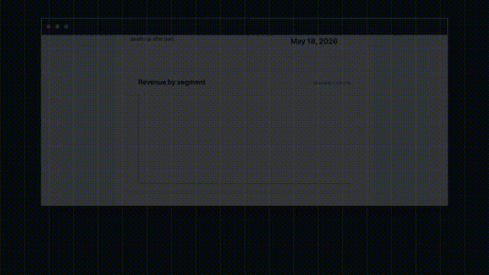

<div align="center">

# 🎯 Canio

### Browser-grade PDFs for Laravel — without the rendering lottery

[](https://github.com/oxhq/canio/actions/workflows/ci.yml)
[](https://packagist.org/packages/oxhq/canio)
[](https://packagist.org/packages/oxhq/canio)
[](https://packagist.org/packages/oxhq/canio)
[](LICENSE)

**Real Chromium. Explicit readiness. Debuggable renders.**
Built on the [Stagehand](runtime/stagehand) runtime in Go.



[Quick start](#-quick-start) · [Why Canio](#-why-canio) · [vs alternatives](#-how-canio-compares) · [Docs](https://oxhq.github.io/canio/)

</div>

---

## 😩 The problem

You've shipped Laravel PDFs before. You know the routine:

- Your Chart.js renders **empty** in the PDF because capture happened before the chart's animation finished.
- Your custom font silently **falls back to Arial** because the browser hadn't loaded it yet.
- Your async data hasn't arrived. Your skeleton loaders end up baked into the PDF.
- A customer reports the invoice "looks weird" from three days ago, and you have no exact render bundle to inspect.
- You add `sleep(3)` and `waitUntilNetworkIdle()`. It works locally. It flakes in production.

That's the lane Canio is built for.

## ⚡ Quick start

```bash
composer require oxhq/canio
php artisan canio:install
```

That's it. Canio downloads its own Stagehand runtime, installs a pinned Chrome for Testing bundle for local rendering, verifies checksums, and runs `canio:doctor`. No daemons to babysit, no Node.js to install.

```php
use Oxhq\Canio\Facades\Canio;

return Canio::view('pdf.invoice', ['invoice' => $invoice])
    ->profile('invoice')
    ->title("Invoice #{$invoice->number}")
    ->stream("invoice-{$invoice->number}.pdf");
```

By default, Canio runs in `embedded` runtime mode. Laravel talks to Stagehand over HTTP, the package can auto-start the local runtime on first render, and the Laravel API stays the same when you move to a remote Stagehand runtime.

## 🎯 Why Canio

The killer feature: **explicit readiness, not timing hacks.**

Inside your Blade view, set Canio's readiness flag to `false` before async work starts, then flip it to `true` when the document is actually ready:

```blade
<script>
  window.__CANIO_READY__ = false;

  Promise.all([
    document.fonts.ready,
    renderChart(window.chartData),
    fetchAndPaintMetrics(),
  ]).then(() => {
    window.__CANIO_READY__ = true;
  });
</script>
```

That `false` matters. The implemented Stagehand contract treats an undefined readiness flag as ready, so simple static pages do not need extra JavaScript. Pages with charts, fonts, async data, or animations opt into waiting by setting `window.__CANIO_READY__ = false` and later resolving it.

No arbitrary `delay(2000)` that's too short on slow CI and wasteful on fast prod. No `waitUntilNetworkIdle()` heuristic that fires at the wrong time. Your view declares when it is done.

## 🆚 Canio vs Browsershot

Same problem: PDF with a chart that must finish rendering.

```php
// With Browsershot: timing heuristics
return Browsershot::html($html)
    ->waitUntilNetworkIdle()
    ->delay(2000)
    ->pdf();
```

```php
// With Canio: explicit document contract
return Canio::view('pdf.invoice', ['invoice' => $invoice])
    ->profile('invoice')
    ->stream();
```

The Blade view owns readiness through `window.__CANIO_READY__`. Stagehand waits for the document to be complete, the readiness flag to resolve, and the configured settle frames before capture.

Browsershot is a good package. Canio is built for the cases where heuristics are not enough and where you need to debug what actually shipped to a customer.

## 🔍 Every render leaves evidence

A customer says the PDF from three days ago looked wrong. With classic HTML-to-PDF flows, the answer is often a shrug.

With Canio, enable debug artifacts on the render:

```php
$result = Canio::view('pdf.invoice', ['invoice' => $invoice])
    ->debug()
    ->save(storage_path('pdf/invoice-123.pdf'));

$artifactId = $result->artifactId();
```

Now you have a full artifact bundle:

| Artifact | What you get |
| --- | --- |
| 📄 **Render spec** | The exact Canio/Stagehand render request |
| 🌲 **DOM snapshot** | The DOM at the moment of capture |
| 🖼️ **Page screenshot** | A PNG of what Chromium painted |
| 📝 **Console log** | Browser console errors, warnings, and logs |
| 🌐 **Network log** | Requests, responses, timing, and failures |
| 📎 **PDF output** | The generated PDF attached to the render result |

Then inspect or replay it:

```php
$artifact = Canio::artifact($artifactId);
$replayed = Canio::replay($artifactId);
```

Or from the CLI:

```bash
php artisan canio:runtime:artifact art-123
```

Production PDF debugging stops being a guessing game.

## ⚙️ The runtime model

Canio is two pieces: a Laravel package and **Stagehand**, a Go-based render runtime that talks to Chrome over CDP.

```text
┌────────────────┐    HTTP    ┌──────────────┐    CDP    ┌─────────┐
│  oxhq/canio    │  ────────► │  Stagehand   │  ──────► │ Chrome  │
│  Laravel pkg   │            │  Go runtime  │           │ CfT     │
└────────────────┘            └──────────────┘           └─────────┘
```

Runtime modes:

- **`embedded`** *(default)*: Laravel installs and starts Stagehand on demand on the same host.
- **`remote`**: Laravel talks to a Stagehand runtime that you run separately.

Renderer drivers inside Stagehand:

- **`rod-cdp`** *(default)*: native Go renderer with local Chrome process management.
- **`local-cdp`**: direct local CDP fallback using a local Chrome/Chromium binary.
- **`remote-cdp`**: Stagehand connects to an already-running Chrome/CDP endpoint.

The Laravel API stays the same across those modes.

Full details: [packages/laravel/README.md](packages/laravel/README.md) · [docs/deployment.md](docs/deployment.md)

## 🚀 What you get

- ⚡ **Real Chromium layout** via Chrome for Testing or a configured Chrome/Chromium binary
- 🎯 **`window.__CANIO_READY__`** readiness for charts, fonts, async data, and animations
- 🔬 **Debug artifacts**: render spec, DOM snapshot, screenshot, console log, network log, and PDF output
- 🧩 **Profiles** for reusable document defaults
- 🔄 **Async rendering** with Stagehand jobs, retries, dead letters, SSE job events, and replay
- 💨 **Render cache** for repeated exact renders in the Stagehand runtime
- 🩺 **`canio:doctor`** to diagnose runtime, browser, and config state
- 🐳 **Docker and systemd deployment assets** for self-hosted Stagehand
- 🪶 **MIT licensed** with no AGPL surprises

## 📦 Install

```bash
composer require oxhq/canio
php artisan canio:install
```

`canio:install` does the heavy work once:

- ✅ Publishes the default config
- ✅ Downloads the matching Stagehand binary
- ✅ Downloads Chrome for Testing for local rendering
- ✅ Verifies checksums
- ✅ Runs `canio:doctor`

In strict environments, install Stagehand and Chrome manually and point Canio at them:

```dotenv
CANIO_RUNTIME_MODE=remote
CANIO_RUNTIME_BASE_URL=http://stagehand.internal:9514
```

or keep embedded Stagehand and use an external CDP browser:

```dotenv
CANIO_RUNTIME_MODE=embedded
CANIO_RENDERER_DRIVER=remote-cdp
CANIO_REMOTE_CDP_ENDPOINT=ws://chrome-renderer.internal:9222/devtools/browser/<id>
```

See [docs/deployment.md](docs/deployment.md).

## 🛠️ Quick tour

### From a Blade view

```php
return Canio::view('pdf.invoice', ['invoice' => $invoice])
    ->profile('invoice')
    ->title("Invoice #{$invoice->number}")
    ->stream();
```

### From raw HTML

```php
return Canio::html($html)
    ->save(storage_path('pdf/report.pdf'));
```

### From a URL

```php
return Canio::url(route('reports.weekly', $report))
    ->debug()
    ->download('report.pdf');
```

### Async jobs

```php
$job = Canio::view('pdf.contract', ['contract' => $contract])
    ->queue('redis', 'pdfs')
    ->retries(2)
    ->debug()
    ->dispatch();

// Later, poll the Stagehand job.
$job = Canio::job($job->id());

if ($job->successful()) {
    $pdf = $job->result()?->pdfBytes();
    $artifactId = $job->artifactId();
}
```

Useful job and failure operations:

```bash
php artisan canio:runtime:job job-123 --watch
php artisan canio:runtime:retry job-123
php artisan canio:runtime:deadletters
php artisan canio:runtime:deadletters:requeue dlq-job-123
php artisan canio:runtime:cleanup
```

Stagehand handles retries and dead-letter persistence. If a render exhausts retries, the dead-letter bundle keeps the archived failure input available for inspection and requeue.

## 📊 How Canio compares

Honest tradeoffs. Pick the right tool for your case:

| Capability | **Canio** | Browsershot | Snappy | Dompdf | Spatie laravel-pdf |
| --- | :---: | :---: | :---: | :---: | :---: |
| Real Chromium layout | ✅ | ✅ | ❌ | ❌ | ✅ |
| Runtime JavaScript | ✅ | ✅ | ⚠️ limited | ❌ | ✅ |
| Explicit readiness contract | ✅ | ⚠️ heuristic | ❌ | ❌ | ⚠️ |
| Debug artifacts | ✅ | ❌ | ❌ | ❌ | ❌ |
| Async jobs, retries, dead letters | ✅ | ❌ | ❌ | ❌ | ⚠️ basic |
| Managed Chrome for Testing install | ✅ | ⚠️ manual | N/A | N/A | ⚠️ |
| Native Go render runtime | ✅ | ❌ Node | ❌ binary | N/A | ❌ Node |
| Lowest uncached latency, simple static doc | ❌ | ❌ | ⚠️ | ✅ | ❌ |
| License | MIT | MIT | MIT | LGPL | MIT |

**Canio wins** on browser-grade rendering, explicit readiness, artifacts, and runtime operations.
**Dompdf and mPDF win** on raw latency for simple static documents.
**Browsershot and Spatie laravel-pdf are useful packages**; Canio is for the cases where timing heuristics and black-box renders are not enough.

Reproducible benchmark harnesses: [benchmarks/README.md](benchmarks/README.md)
Public benchmark summary: [docs/benchmark-summary.md](docs/benchmark-summary.md)

## 🛑 When **not** to use Canio

We would rather you pick the right tool than the marketed one.

- 👉 **You only render simple static HTML and care most about cold-start latency.** Use Dompdf or mPDF.
- 👉 **You only need response-cached HTML to PDF and no JavaScript execution.** Snappy can still be fine.
- 👉 **You cannot run Chromium or reach a CDP service in your environment.** Use a renderer that fits that host.
- 👉 **You only need Markdown to PDF.** Use a Markdown-native renderer.

Canio adds value when correctness depends on browser behavior — not when you just need to spit out a PDF as fast as possible.

## 💼 Canio Cloud (optional)

Canio OSS is the product. It runs standalone and stays useful without Cloud.

Canio Cloud is an optional managed layer for teams that want render capacity, artifact history, and operational visibility without operating every runtime themselves. It is not part of the required install path, and OSS never depends on it.

If you are interested: [oxhq.github.io/canio/cloud](https://oxhq.github.io/canio/cloud/)

## 🩺 Status & support

- **Current stable**: `v1.0.6`
- The current stable release line for the Laravel package is `v1.0.6`.
- **Stable line**: `^1.0`, public Packagist install path is `oxhq/canio`
- **PHP**: `^8.2`
- **Laravel**: `^10.0 | ^11.0 | ^12.0 | ^13.0`
- **Runtime**: Stagehand `v1.0.6`

## 📚 Docs

- 🌐 [Public docs](https://oxhq.github.io/canio/)
- 📦 [Laravel package guide](packages/laravel/README.md)
- 🚢 [Production deployment](docs/deployment.md)
- 🏗️ [Architecture notes](docs/architecture.md)
- 📜 [Render contract](docs/render-contract.md)
- 📊 [Benchmark summary](docs/benchmark-summary.md)
- 📣 [v1.0.0 launch announcement](docs/announcements/v1.0.0.md)
- 📝 [v1.0.6 release notes](docs/releases/v1.0.6.md)
- 🤝 [Contributor setup](docs/development.md)

## 🤝 Contributing

Issues, ideas, and PRs are very welcome. Especially useful:

- New profiles for common document types: invoices, certificates, contracts, reports
- Real-world bug reports with a saved artifact bundle attached
- Benchmark harness improvements
- Docs and tutorial contributions

See [CONTRIBUTING.md](CONTRIBUTING.md) and [CODE_OF_CONDUCT.md](CODE_OF_CONDUCT.md).

## 🔒 Security

Found a vulnerability? Please do not open a public issue. See [SECURITY.md](SECURITY.md) for the responsible disclosure path.

## 📄 License

Canio is open-sourced software licensed under the [MIT license](LICENSE).

---

<div align="center">

**Built with ❤️ and ☕ in Tijuana, for the Laravel community.**

If Canio saved you from a PDF rendering rabbit hole, a ⭐ on this repo is the best thank-you.

[GitHub](https://github.com/oxhq/canio) · [Packagist](https://packagist.org/packages/oxhq/canio) · [Docs](https://oxhq.github.io/canio/)

</div>
